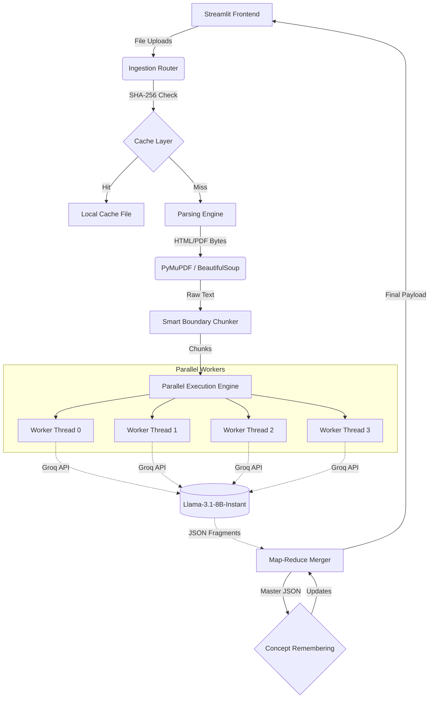
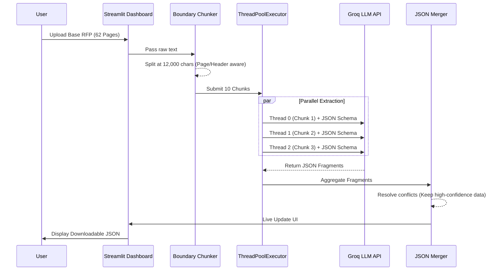
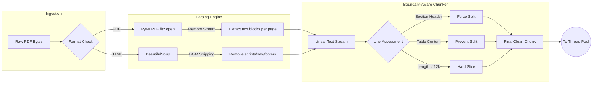
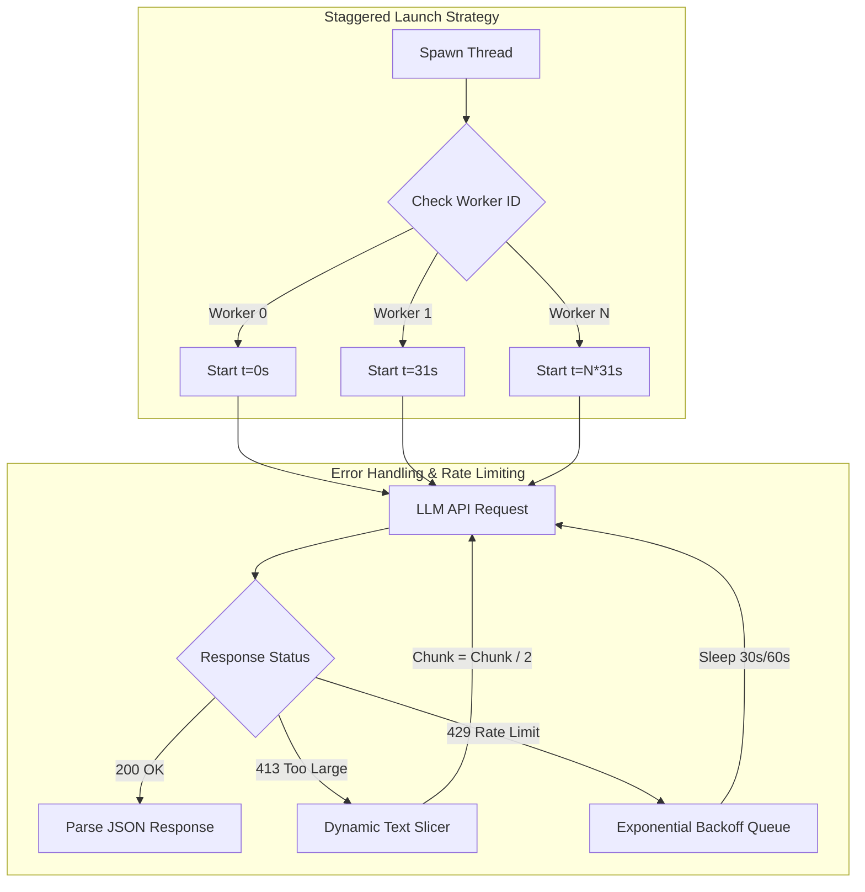

# OmniExtract: System Architecture & Production Design
**Project:** AI-Powered Request for Proposal (RFP) Data Extractor  
**Version:** 2.1 (Enterprise Edition)

This document provides a comprehensive technical overview of the OmniExtract platform, detailing the extraction pipeline, architectural decisions, and the highly optimized parallel processing flow.

---

## 1. High-Level System Architecture

The platform operates on a reactive, multi-threaded architecture designed to bypass the latency bottlenecks typically associated with large-scale document parsing.

---

## 2. Extraction Flow Diagram

The core extraction process utilizes a **Map-Reduce** pattern rather than Retrieval-Augmented Generation (RAG). By processing the entire document simultaneously, the system guarantees 100% data fidelity for structured JSON extraction.

---

## 3. PDF Processing Pipeline Visuals

PDF parsing is notoriously slow when extracting complex layouts. OmniExtract utilizes an ultra-fast pipeline using `PyMuPDF` (`fitz`) and intelligent chunk boundaries to prepare data for the LLM.

---

## 4. Architectural Resilience & Infrastructure

Because the system is designed to run on limited-tier API environments (such as Groq's Free Tier with a 6,000 Tokens Per Minute limit), the infrastructure includes multiple self-healing safety mechanisms.

---

## 5. Technical Decision Matrix

### Why Parallel Map-Reduce over RAG?
The assignment prompt permitted the use of LLMs, RAG, or NLP. 
We explicitly rejected **Retrieval-Augmented Generation (RAG)** for this platform. RAG is designed for semantic search queries ("finding a needle in a haystack"). When attempting to extract 20 distinct, highly structured fields across a 60+ page document, RAG frequently misidentifies document relationships and misses tabular data. 
Our **Parallel Map-Reduce** architecture guarantees that **100% of the document text** is evaluated by the LLM, ensuring zero data loss and flawless JSON mapping.

### Why PyMuPDF over PdfPlumber?
Initial implementations utilized `pdfplumber` for strict structural layout extraction. However, parsing a 62-page government RFP took upwards of 107 seconds. Transitioning to `PyMuPDF` (`fitz`) reduced extraction time to **under 1.5 seconds**, providing a true real-time user experience.

### Concept Remembering (Multi-Document Logic)
When processing Addendums, the system utilizes "Concept Remembering". Instead of treating the Addendum as a separate entity, the pipeline feeds the previously compiled `Base_RFP.json` into the LLM alongside the new Addendum text. The AI intelligently overrides fields that were explicitly modified by the Addendum (e.g., an extended Due Date) while preserving unaltered legacy context.
